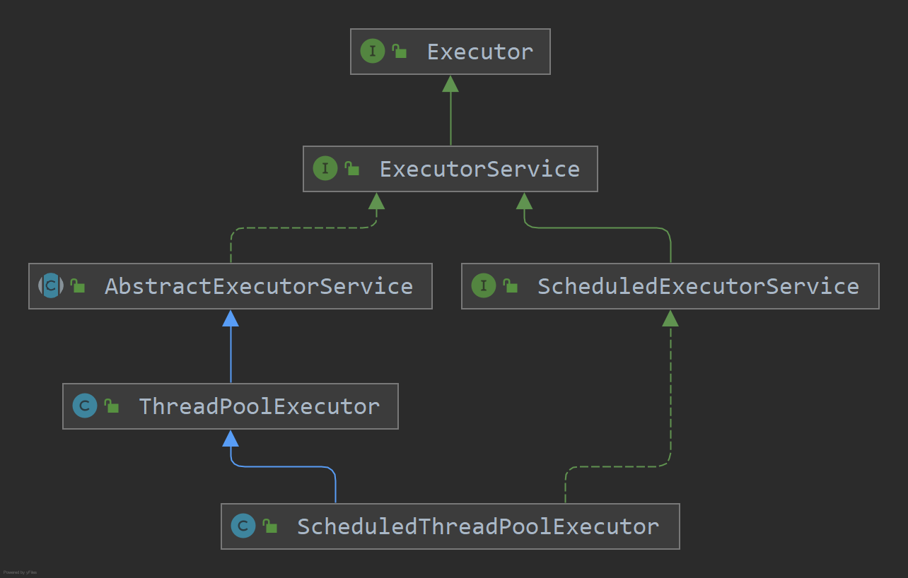

# Executor

执行已提交的可运行任务的对象。这个接口提供了一种将任务提交与每个任务如何运行的机制(包括线程使用、调度等细节)解耦的方法。通常使用Executor而不是显式创建线程。

# Executor 框架结构

## 1、任务

执行任务需要实现**`Runnable`** 接口或**`Callable`**接口

**`Runnable` 接口**或 **`Callable` 接口** 实现类都可以被 **`ThreadPoolExecutor`** 或 **`ScheduledThreadPoolExecutor`** 执行。

## 2、任务的执行

核心接口**`Executor`** ，以及继承 `Executor` 接口的 **`ExecutorService` **接口。

**`ThreadPoolExecutor`** 和 **`ScheduledThreadPoolExecutor`** 这两个关键类实现了 **ExecutorService 接口**。

## 3、异步计算的结果

**`Future`** 接口以及 `Future` 接口的实现类 **`FutureTask`** 类都可以代表异步计算的结果。

当把 **`Runnable`接口** 或 **`Callable` 接口** 的实现类提交给 **`ThreadPoolExecutor`** 或 **`ScheduledThreadPoolExecutor`** 执行。（调用 `submit()` 方法时会返回一个实现了 **`Future`接口**的对象）。

# Executor 框架的使用示意图

1. **主线程首先要创建实现 `Runnable` 或者 `Callable` 接口的任务对象。**

2. **把创建完成的实现 `Runnable`/`Callable`接口的 对象直接交给 `ExecutorService` 执行**: `ExecutorService.execute（Runnable command）`）或者也可以把 `Runnable` 对象或`Callable` 对象提交给 `ExecutorService` 执行（`ExecutorService.submit（Runnable task）`或 `ExecutorService.submit（Callable <T> task）`）。

3. **如果执行 `ExecutorService.submit（…）`，`ExecutorService` 将返回一个实现`Future`接口的对象**

   由于 `FutureTask` 实现了 `Runnable`，我们也可以创建 `FutureTask`，然后直接交给 `ExecutorService` 执行。

4. 最后，主线程可以执行 `FutureTask.get()`方法来等待任务执行完成。主线程也可以执行 `FutureTask.cancel（boolean mayInterruptIfRunning）`来取消此任务的执行。

