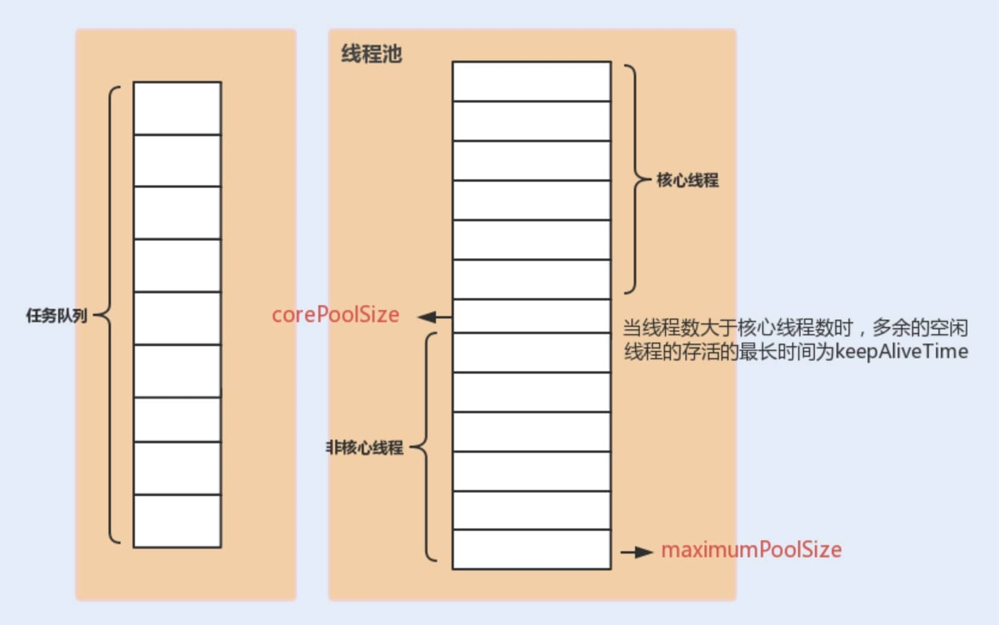
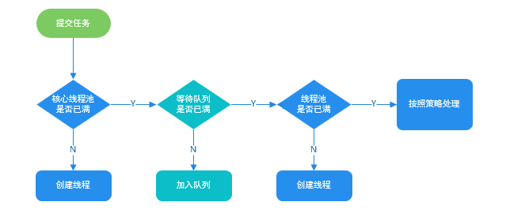

# ThreadPoolExecutor

## 构造方法

~~~java
    public ThreadPoolExecutor(int corePoolSize,
                              int maximumPoolSize,
                              long keepAliveTime,
                              TimeUnit unit,
                              BlockingQueue<Runnable> workQueue,
                              ThreadFactory threadFactory,
                              RejectedExecutionHandler handler) {

    }
~~~

# 七大参数

### corePoolSize

the number of threads to keep in the pool, even if they are idle, unless allowCoreThreadTimeOut is set

线程池中保留的线程数，即使它们是空闲的，除非设置allowCoreThreadTimeOut

### maximumPoolSize

the maximum number of threads to allow in the pool

池中允许的最大线程数

### keepAliveTime

when the number of threads is greater than the core, this is the maximum time that excess idle threads will wait for new tasks before terminating.

当线程数大于核心数时，这是剩余空闲线程在终止前等待新任务的最大时间。

### unit

the time unit for the keepAliveTime argument

### workQueue

the queue to use for holding tasks before they are executed. 

This queue will hold only the Runnable tasks submitted by the execute method.

在任务执行之前用来保存任务的队列。

这个队列将只保存由execute方法提交的Runnable任务。

### threadFactory

the factory to use when the executor creates a new thread

执行器创建新线程时要使用的工厂

### handler

the handler to use when execution is blocked because the thread bounds and queue capacities are reached

当执行因线程边界和队列容量达到而被阻塞时使用的处理程序

# 饱和策略

如果当前同时运行的线程数量达到最大线程数量并且队列也已经被放满了任务时，`ThreadPoolTaskExecutor` 定义一些策略:

- **`ThreadPoolExecutor.AbortPolicy`** ：抛出 `RejectedExecutionException`来拒绝新任务的处理。
- **`ThreadPoolExecutor.CallerRunsPolicy`** ：调用执行自己的线程运行任务，也就是直接在调用`execute`方法的线程中运行(`run`)被拒绝的任务，如果执行程序已关闭，则会丢弃该任务。因此这种策略会降低对于新任务提交速度，影响程序的整体性能。如果您的应用程序可以承受此延迟并且你要求任何一个任务请求都要被执行的话，你可以选择这个策略。
- **`ThreadPoolExecutor.DiscardPolicy`** ：不处理新任务，直接丢弃掉。
- **`ThreadPoolExecutor.DiscardOldestPolicy`** ： 此策略将丢弃最早的未处理的任务请求。

# 阿里巴巴 Java 开发手册

在《阿里巴巴 Java 开发手册》“并发处理”这一章节，明确指出线程资源必须通过线程池提供，不允许在应用中自行显式创建线程。

> 使用线程池的好处是减少在创建和销毁线程上所消耗的时间以及系统资源开销，解决资源不足的问题。如果不使用线程池，有可能会造成系统创建大量同类线程而导致消耗完内存或者“过度切换”的问题

《阿里巴巴 Java 开发手册》中强制线程池不允许使用 `Executors` 去创建，而是通过 `ThreadPoolExecutor` 构造函数的方式，这样的处理方式让写的同学更加明确线程池的运行规则，规避资源耗尽的风险 

`Executors` 返回线程池对象的弊端如下：

* **`FixedThreadPool` 和 `SingleThreadExecutor`** ： 允许请求的队列长度为 `Integer.MAX_VALUE`，可能堆积大量的请求，从而导致 OOM。
* **`CachedThreadPool` 和 `ScheduledThreadPool`** ： 允许创建的线程数量为 `Integer.MAX_VALUE` ，可能会创建大量线程，从而导致 OOM。

# 使用+原理分析

ThreadPoolExecutor的execute方法

按3个步骤进行：

1. 如果运行的线程少于corePoolSize，则尝试将给定的命令作为其第一个任务启动一个新线程。对addWorker的调用会自动检查runState和workerCount，从而通过返回false来防止误报，因为误报会在不应该添加线程的时候添加线程。
2. 如果一个任务可以成功排队，那么我们仍然需要重复检查是否应该添加线程（因为现有的已经在上次检查后死亡）或那样进入这个方法后，池关闭了。因此，我们将重新检查状态，并在必要时在停止队列时回滚队列，或者在没有队列时启动一个新线程。
3. 如果我们不能对任务进行排队，那么我们将尝试添加一个新线程。如果它失败了，我们知道我们已经关闭或饱和了，所以拒绝任务。

~~~java
   // 存放线程池的运行状态 (runState) 和线程池内有效线程的数量 (workerCount)
   private final AtomicInteger ctl = new AtomicInteger(ctlOf(RUNNING, 0));

    private static int workerCountOf(int c) {
        return c & CAPACITY;
    }
    // 任务队列
    private final BlockingQueue<Runnable> workQueue;

	public void execute(Runnable command) {
        // 任务为空，抛出异常
        if (command == null)
            throw new NullPointerException();
        // 获取线程池的状态信息
        int c = ctl.get();
        // 小于核心线程数，通过addWorker(command, true)新建一个线程，并将任务(command)添加到该线程中；
        // 然后，启动该线程从而执行任务。
        if (workerCountOf(c) < corePoolSize) {
        if (workerCountOf(c) < corePoolSize) {
            if (addWorker(command, true))
                return;
            c = ctl.get();
        }
        //如果当前之行的任务数量大于等于 corePoolSize 的时候就会走到这里
        // 通过 isRunning 方法判断线程池状态，处于 RUNNING 状态才会被并且队列可以加入任务，该任务才会被加入进去 
        if (isRunning(c) && workQueue.offer(command)) {
            int recheck = ctl.get();
            // 再次获取线程池状态，如果线程池状态不是 RUNNING 状态就需要从任务队列中移除任务，并尝试判断线程是否全部执行完毕。同时执行拒绝策略。
            if (! isRunning(recheck) && remove(command))
                reject(command);
            // 如果当前线程池为空就新创建一个线程并执行。
            else if (workerCountOf(recheck) == 0)
                addWorker(null, false);
        }
        //3. 通过addWorker(command, false)新建一个线程，并将任务(command)添加到该线程中；然后，启动该线程从而执行任务。
        //如果addWorker(command, false)执行失败，则通过reject()执行相应的拒绝策略的内容。
        else if (!addWorker(command, false))
            reject(command);
    }
~~~

# 任务提交和任务执行

execute和submit

## execute

* execute只能执行Runnable类型的任务，无返回值
* 执行任务时，遇到异常会直接抛出

~~~java
    // Executes the given task sometime in the future.
	public void execute(Runnable command) {
    }
~~~

## submit

* 可以提交Runnable类型的任务，返回值为null
* 也可以提交Callable类型的任务，会有一个Future类型的返回值
* 不会直接抛出异常，只有在使用Future的get方法获取返回值时，才会抛出异常

~~~java
    public Future<?> submit(Runnable task) {
    }

    public <T> Future<T> submit(Runnable task, T result) {
    }

    public <T> Future<T> submit(Callable<T> task) {
    }
~~~

Waits if necessary for the computation to complete, and then retrieves its result.
Returns:	the computed result
Throws:
CancellationException – if the computation was cancelled
ExecutionException – if the computation threw an exception
InterruptedException – if the current thread was interrupted while waiting

~~~java
	V get() throws InterruptedException, ExecutionException;
~~~

# 线程池参数调节

CPU密集型（计算密集型）：corePoolSize = CPU核数 + 1

IO密集型：corePoolSize = CPU核数 * 2

# 线程池监控

* getActiveCount：返回活动执行任务的大约线程数。
* getCompletedTaskCount()：返回已完成执行的任务的大致总数。
* getCorePoolSize()：返回核心线程数。
* getLargestPoolSize()：返回池中同时存在的最大线程数。
* getMaximumPoolSize()：返回允许的最大线程数。
* getPoolSize()：返回当前线程池中的线程数。
* getTaskCount()：返回计划执行的任务的大致总数。

# Runnable VS Callable

`Runnable`自 Java 1.0 以来一直存在，但`Callable`仅在 Java 1.5 中引入,目的就是为了来处理`Runnable`不支持的用例。**`Runnable` 接口**不会返回结果或抛出检查异常，但是 **`Callable` 接口**可以。

所以，如果任务不需要返回结果或抛出异常推荐使用 **`Runnable` 接口**，这样代码看起来会更加简洁。

工具类 `Executors` 可以实现将 `Runnable` 对象转换成 `Callable` 对象。（`Executors.callable(Runnable task)` 或 `Executors.callable(Runnable task, Object result)`）。

# execute VS submit

* `execute()`方法用于提交不需要返回值的任务，所以无法判断任务是否被线程池执行成功与否；

* `submit()`方法用于提交需要返回值的任务。线程池会返回一个 `Future` 类型的对象，通过这个 `Future` 对象可以判断任务是否执行成功，并且可以通过 `Future` 的 `get()`方法来获取返回值，`get()`方法会阻塞当前线程直到任务完成，而使用 `get（long timeout，TimeUnit unit）`方法的话，如果在 `timeout` 时间内任务还没有执行完，就会抛出 `java.util.concurrent.TimeoutException`。

# shutdown VS shutdownNow

**`shutdown（）`** :关闭线程池，线程池的状态变为 `SHUTDOWN`。线程池不再接受新任务了，但是队列里的任务得执行完毕。

**`shutdownNow（）`** :关闭线程池，线程的状态变为 `STOP`。线程池会终止当前正在运行的任务，并停止处理排队的任务并返回正在等待执行的 List

# isTerminated VS isShutdown

- **`isShutDown`** 当调用 `shutdown()` 方法后返回为 true。
- **`isTerminated`** 当调用 `shutdown()` 方法后，并且所有提交的任务完成后返回为 true

[Java 线程池详解 | JavaGuide](https://javaguide.cn/java/concurrent/java-thread-pool-summary/#)

